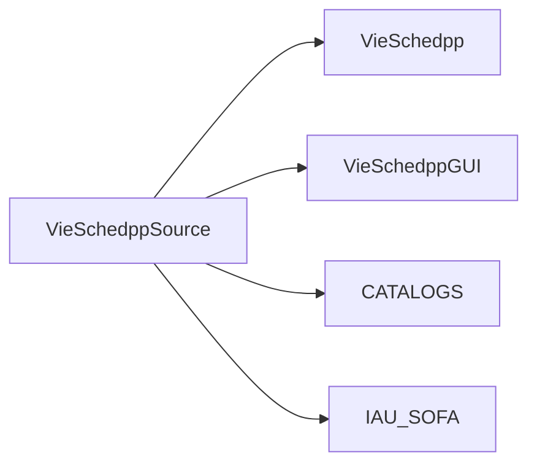

# VieSched++ Graphical User Interface (GUI)

written by Matthias Schartner
contact: matthias.schartner@geo.tuwien.ac.at

## Installation 

This section descripes how to install __VieSched++ GUI__ on LINUX. 

While an installation is possible on Windows (tested with Windows 10) it is no 
further discussed due to the many possibilieties of different compilers and options. 

## Recommended software folder structure for VieSched++

The full __VieSched++__ software contains 4 different packages which are all available in git under `git.geo.tuwien.ac.at/vievs/VieSchedpp/`

It is recommended to copy the source code into one common directory here called `VieSchedppSource`

## Dependencies

