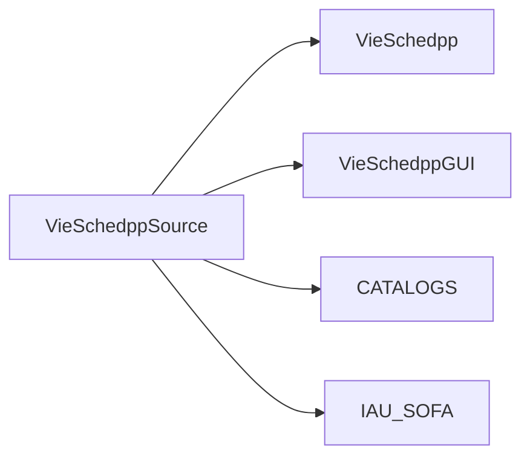

# VieSched++

VLBI scheduling software

written by Matthias Schartner
contact: matthias.schartner@geo.tuwien.ac.at

# Installation 

This section descripes how to install __VieSched++__ on LINUX. 

While an installation is possible on Windows (tested with Windows 10) it is no 
further discussed due to the many possibilieties of different compilers and options. 

## Dependencies

Before you install __VieSched++__ check if you have the following dependencies installed:

* gcc/g++ (tested with version 7.2.0, 7.3.0 and 8.1.0)
  * possible installation on Ubuntu: `sudo apt-get install build-essentials`
* SOFA libraries
  * check out git project `vievs/VieSchedpp/IAU_SOFA.git` or visit http://www.iausofa.org/
* boost c++ libraries (tested with version 1.58.00, 1.64.0 and 1.67.0)
  * possible installation on Ubuntu: `sudo apt-get install libboost-all-dev` or check out https://www.boost.org/
* cmake (tested with Version 3.8 and 3.12)
  * possible installation on Ubuntu: `sudo apt-get install cmake` or visit https://cmake.org/
* some other basic dependencies should already be part of your operating system or previous packages

## Recommended software folder structure

The full software contains 4 different packages which are all available in git under `git.geo.tuwien.ac.at/vievs/VieSchedpp/`

It is recommended to copy the source code into one common directory here called `VieSchedppSource`

## Build 

clone git repository into `VieSchedppSource` or copy source code into `VieSchedppSource/VieSchedpp`
    
    cd VieSchedppSource
    git clone git@git.geo.tuwien.ac.at:vievs/VieSchedpp/VieSchedpp.git

make sure that the `IAU_SOFA` library is already build in `VieSchedppSource/IAU_SOFA/Release/libsofa_c.a`. 
See `README.md` from `IAU_SOFA` for help.
    
browse to newly created folder `VieSchedpp`

    cd VieSchedpp
    
create new folder `Release` and browse there

    mkdir Release
    cd Release

run CMake with `Release` flag with `CMakeLists.txt` from parent directory:

    cmake -DCMAKE_BUILD_TYPE=Release .. 
    
run make

    make 
    
You should now be able to find the program in `VieSchedppSource/VieSchedpp/Release`

## Build without c++ boost libraries

Do the same as descriped in the previouse section but before running 
`cmake -DCMAKE_BUILD_TYPE=Release .. ` open file `CMakeLists.txt` in 
`VieSchedppSource/VieSchedpp/` and change the boost blocks. 
(commend first block and uncommend second block)

## Troubleshooting

### Installation

After calling `cmake` your output should look like the following:

    -- The C compiler identification is GNU 7.2.0
    -- The CXX compiler identification is GNU 7.2.0
    -- Check for working C compiler: /usr/bin/cc
    -- Check for working C compiler: /usr/bin/cc -- works
    -- Detecting C compiler ABI info
    -- Detecting C compiler ABI info - done
    -- Detecting C compile features
    -- Detecting C compile features - done
    -- Check for working CXX compiler: /usr/bin/c++
    -- Check for working CXX compiler: /usr/bin/c++ -- works
    -- Detecting CXX compiler ABI info
    -- Detecting CXX compiler ABI info - done
    -- Detecting CXX compile features
    -- Detecting CXX compile features - done
    -- Found OpenMP_C: -fopenmp (found version "4.5") 
    -- Found OpenMP_CXX: -fopenmp (found version "4.5") 
    -- Found OpenMP: TRUE (found version "4.5")  
    OpenMP found
    -- Looking for pthread.h
    -- Looking for pthread.h - found
    -- Looking for pthread_create
    -- Looking for pthread_create - found
    -- Found Threads: TRUE  
    -- Boost version: 1.64.0
    -- Found the following Boost libraries:
    --   log
    --   log_setup
    --   system
    --   date_time
    --   filesystem
    --   thread
    --   regex
    --   chrono
    --   atomic
    Boost VERSION: 106400
    Boost INCLUDE_DIRS: /usr/local/include
    Boost Boost_LIBRARY_DIRS: /usr/local/lib
    Boost LIBRARIES: /usr/local/lib/libboost_log.a;/usr/local/lib/libboost_log_setup.a;/usr/local/lib/libboost_system.a;/usr/local/lib/libboost_date_time.a;/usr/local/lib/libboost_filesystem.a;/usr/local/lib/libboost_thread.a;/usr/local/lib/libboost_regex.a;/usr/local/lib/libboost_chrono.a;/usr/local/lib/libboost_atomic.a
    SOFA library found: /home/mschartn/programming/test/IAU_SOFA/Release/libsofa_c.a
    VieSched++ version: f20be1498274232acb46cf44121f9e60278c6528
    -- Configuring done
    -- Generating done
    -- Build files have been written to: /home/mschartn/programming/test/VieSchedpp/Release

----

If your Output contains some `CMake` warnings like:

    CMake Warning at /usr/share/cmake-3.5/Modules/FindBoost.cmake:725 (message):
      Imported targets not available for Boost version 106400

check if your `CMake` version supports `boost` version and install the newest version of CMake from https://cmake.org/.

----

If you get error messages during linking with functions called: `*boost*` or `iau_*`:

Check if your `c++ boost libraries` and the `SOFA` library is found. If not set the path to this libraries in the `CMakeLists.txt` file.

----

If you have troubles getting `boost` to work simply try to build it without `c++ boost libraries` (header only - see `CMakeLists.txt` file `BOOST` section). 

----

If you still have troubles installing the software contact me under: _matthias.schartner@geo.tuwien.ac.at_. 

### Software errors

__VieSched++__ is still in developing, there might be bugs or crashes. 

Please always have a look at the log file and have a look if you get some [warning], [error] or [fatal] messages. 

In case __VieSched++__ crashes or it reports an error in the log files please contact me under: _matthias.schartner@geo.tuwien.ac.at_. 

Please attach: 
* your current software version number (you can find it in the beginning of your log file, or in the .skd or .vex files - it is a hash code like `f20be1498274232acb46cf44121f9e60278c6528`)
* your parameters.xml file 
* your used catalog files
* your log file `VieSchedpp_yyyy-mm-dd_hh-mm-ss.sss.log`
* any other helpful information 

## Develop VieSched++

In case you want to develop __VieSched++__ have a look at the `doxygen` documentation and use an appropriate IDE. 

* VieSchedpp was developed using the CLion. https://www.jetbrains.com/clion/
* VieSchedppGUI was developed using QtCreator http://doc.qt.io/qtcreator/